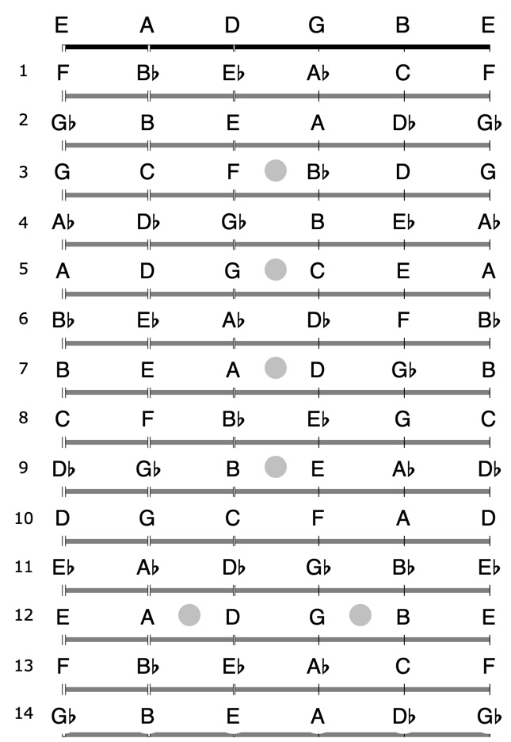
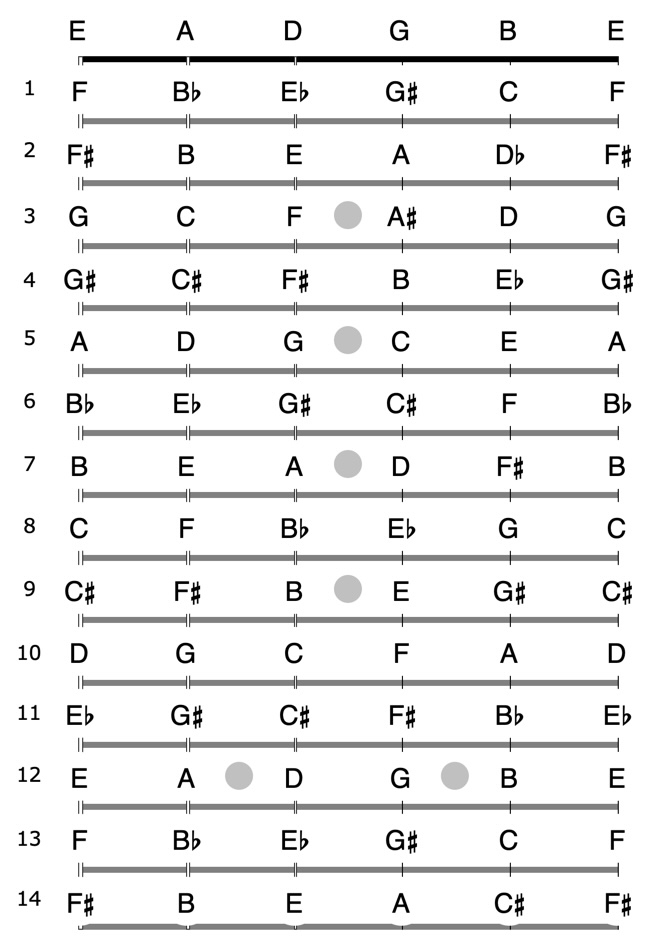

# La tastiera della chitarra

Il termine "corda vuote" si riferisce al suono che la corda produce quando non premiamo alcun tasto sul manico (o tastiera).\
Se assumiamo che lo strumento si accordato in modo _standard_, le note prodotte dalle corde sono elencate nel seguente diagramma:

<figure><figcaption>
Note sulla tastiera (alterazioni in bemolle)
</figcaption></figure>

In questo diagramma abbiamo espresso le note tra F e G, G ed A, A e B, C e D e D ed E come bemolli (Gb, Ab, Bb, Db, Eb). Possiamo ottenere lo stesso diagramma con le note alterate espresse in diesis (F#, G#, A#, C#, D#):

<figure><figcaption>
Note sulla tastiera (alterazioni in diesis)
</figcaption></figure>

È molto importante imparare i nome delle note su tutta la tastiera. Sebbene possa sembrare un compito arduo è possibile memorizzare le note usando un approccio sistematico:

1. memorizza i nome delle corde vuote: **E A D G B E**
2. le note sulla 1a e sulla 6a corda hanno sempre la stessa lettera se si trovano sullo stesso tasto
3. le note sul 5° tasto sono le stessa sulla corda vuota adiacente più _alta_ (con la sola eccezione della 3a corda, per la quale dobbiamo prendere in considerazione il 4° tasto). Quando parlo di più alta intendo che la 1a corda è la più alta e la 6a corda è la più bassa. Queste note sul 5° tasto (4° tasto per la 3a corda) saranno il nostro _1° punto di di riferimento_.
4. le note sul 12° tasto hanno lo stesso nome delle corde vuote (ma sono un'_ottava_ più alte) e le note che partono dal 13° tasto sono identiche a quelle che partono dal 1° tasto (ma un'_ottava_ più alta). Le note sul 12° tasto saranno il nostro _2° punto di riferimento_.

Proviamo a trovare F# su ogni corda. Partendo dalla 6a corda i nostri punti di riferimento sono A ed E; chiediamoci tra A ed E quale è più vicina a F#, la cui è risposta è E (12° tasto), in particolare è due tasti sopra (E - F - F#), quindi 14° tasto e per il punto (4) sarà anche il 2° tasto.\
Per quanto riguarda la 5a corda, abbiamo D e A, la nota più vicina è A (F# - G - G# - A), 3 tasti indietro, quindi 9° tasto.\
Nello stesso modo possiamo trovare F# su tutte le altre corde.

Dedica pochi minuti ogni giorno a questo esercizio e imparerai le note sulla tastiera in breve tempo.&#x20;
